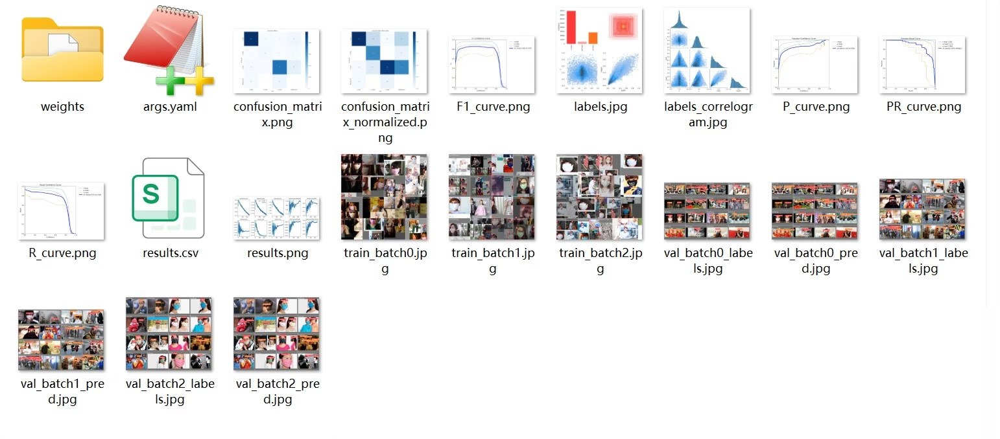
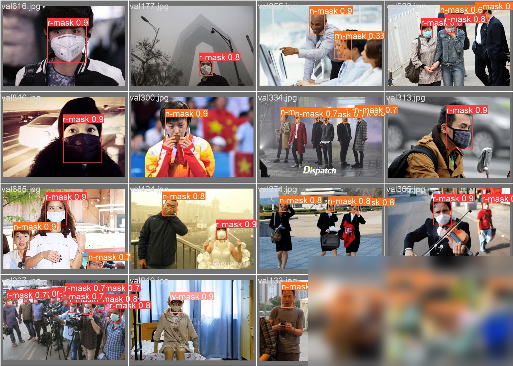

# Mask-800n is a pre-trained model for object detection. It can be used for tasks such as object detection segmentation and recognition. To use this model you need to download the Mask-800n model file (pt format) from the official website or a reliable source.

Here's an example of how to download the Mask-800n model file

1. Go to the Mask-800n model page on the official website or a reliable source.
2. Click on the "Download" button to download the model file.
3. Save the downloaded file to your computer.

Once you have the Mask-800n model file, you can use it in your Python code by importing it into your script. Here's an example of how to import the Mask-800n model file into a Python script using the `torch` library

```python
import torch
from PIL import Image
import numpy as np

# Load the Mask-800n model file
mask_model = torch.hub.load('ultralytics/transformers', 'mask_rcnn_coco_2017_11_28', map_location='cpu

# Load the image
image = Image.open('path/to/your/image.jpg

# Preprocess the image
image = image.resize((640, 640
image = image.convert('RGB
image = image.crop((0, 0, 640, 640
image = image.normalize(p=255).unsqueeze_(0

# Run the model
output = mask_model(image

# Display the result
for i in range(output.shape[0
print(f"Class: {output[i].item()}, Score: {output[i].item()}
```

Make sure to replace `'path/to/your/image.jpg'` with the path to your actual image file.

# Body

Mask-800n is a pre-trained model for object detection. It can be used for tasks such as object detection, segmentation, and recognition. To use this model, you need to download the Mask-800n model file (pt format) from the official website or a reliable source.

Here's an example of how to download the Mask-800n model file

1. Go to the Mask-800n model page on the official website or a reliable source.
2. Click on the "Download" button to download the model file.
3. Save the downloaded file to your computer.

Once you have the Mask-800n model file, you can use it in your Python code by importing it into your script. Here's an example of how to import the Mask-800n model file into a Python script using the `torch` library

```python
import torch
from PIL import Image
import numpy as np

# Load the Mask-800n model file
mask_model = torch.hub.load('ultralytics/transformers', 'mask_rcnn_coco_2017_11_28', map_location='cpu

# Load the image
image = Image.open('path/to/your/image.jpg

# Preprocess the image
image = image.resize((640, 640
image = image.convert('RGB
image = image.crop((0, 0, 640, 640
image = image.normalize(p=255).unsqueeze_(0

# Run the model
output = mask_model(image

# Display the result
for i in range(output.shape[0
print(f"Class: {output[i].item()}, Score: {output[i].item()}
```

Make sure to replace `'path/to/your/image.jpg'` with the path to your actual image file.

# Images




# Payment

Here is a pay link on Stripe ( https://buy.stripe.com/3cs8yP7sY87d0vu9AB ). Please contact me lonlonago@foxmail.com after funding $89, and I will send you a complete data files , thank you


Computer vision/deep learning algorithm services primarily focus on areas such as object detection, image segmentation, multimodal analysis, defect detection, face recognition, OCR, medical image analysis, autonomous driving perception, video understanding, behavior recognition, point cloud processing, image enhancement and restoration, image retrieval, and motion prediction.
Communication can be conducted based on specific tasks: model replication, algorithm optimization, performance improvement, model modification, code interpretation/code analysis, data processing, environment configuration, parameter tuning, experimental design, and result analysis, etc.
Core direction overview:
1. Object detection/tracking
Object detection, salient object detection, keypoint detection, lane line detection, point cloud object detection, point cloud segmentation, object tracking, motion detection, motion prediction.
2. Image segmentation/reconstruction
Image segmentation, semantic segmentation, medical image segmentation, geographic information segmentation, remote sensing data segmentation, 3D reconstruction, super-resolution reconstruction, point matching.
3. Face recognition/OCR/Industrial inspection
Face recognition, face detection, mask detection, license plate recognition, text recognition, OCR, defect detection, industrial inspection, anomaly detection.
4. Video understanding/behavior recognition
Video understanding, behavior recognition, pose estimation, gesture recognition, fight recognition, depth estimation, and autonomous driving perception.
5. Image enhancement/restoration
Image dehazing, image deraining, denoising, defogging, image restoration, and image compression.
6. Multimodal/large model related
The directions of multimodal, large model fine-tuning, algorithm analysis, and joint image-text representation are communicable.
Technology stack:
Inference frameworks: TensorRT, ONNX, OpenVINO
Common models/directions: YOLO, GAN, VIT, SLAM, diffusion models, etc. Discussions can be held based on project requirements.
Application fields:
For applications such as street view, medicine, remote sensing, daily scenes, industrial inspection, autonomous driving, and biomedical imaging, we can first discuss the specific requirements.
Individual work, suitable for developers with experience in computer vision, deep learning, algorithm replication, model optimization, code development, and project requirements.
The price is determined based on the difficulty and workload of the project.
Individual order receiving, quality guaranteed, after-sales service guaranteed. Welcome to directly send a private message to specify the specific task. We can communicate according to the specific task: model replication, algorithm optimization, performance improvement, model modification, code interpretation/code analysis, data processing, environment configuration, parameter tuning, experimental design and result analysis, etc.
Contact information: lonlonago@foxmail.com

